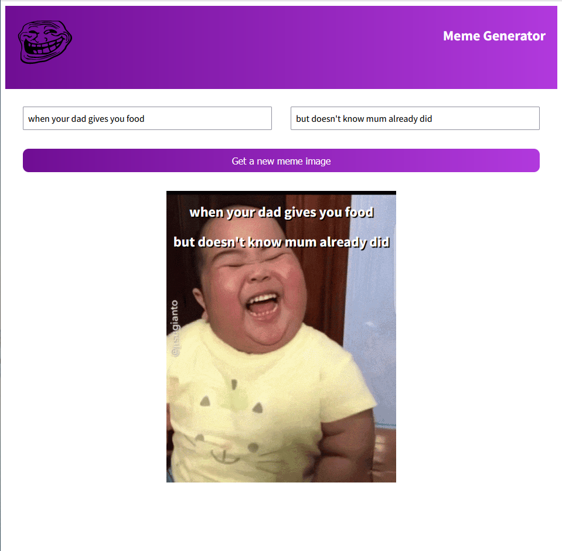

# Meme generator

**This is an exercise which is a part of ![React Course - Beginner's Tutorial for React JavaScript Library [2022]](https://www.youtube.com/watch?v=bMknfKXIFA8&t=31577s)**



#### This project is a meme generator - which generates a random meme gif and allows the user to insert text suitable to the meme.

## Goal of this exercise: 

- Have a good grasp of how conditional rendering works (&&, if... else statement, ternary operator)

- Settings state from child components

- React forms, form inputs , form state , controlled inputs practice 

## Technologies used: 
- HTML, CSS, JavaScript, React using a third party API 


## How to run this project in your local laptop/computer:

```
cd meme-generator (root folder)

npm install 

npm start 


```